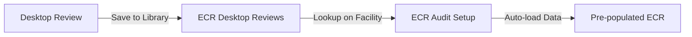
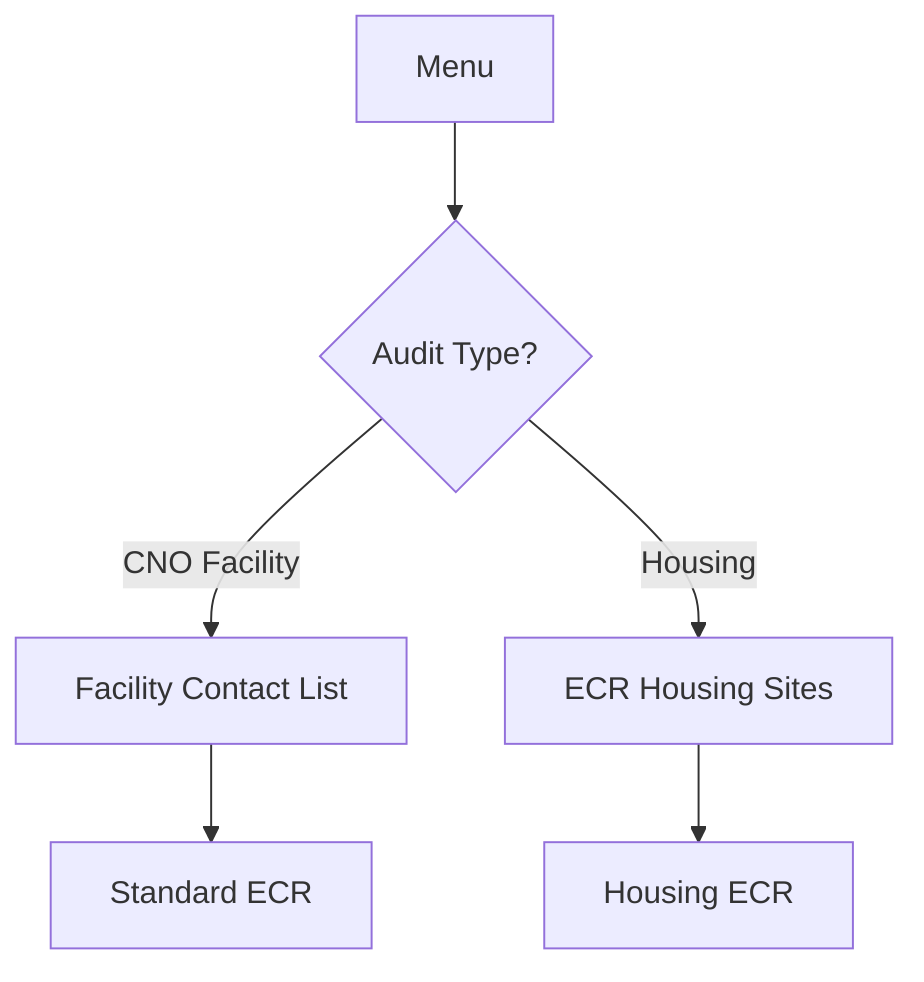

# ECR Audit Application - Implementation Guide

## Overview
This guide documents the enhancements made to the ECR Audit Application to support:
1. **ECR Desktop Reviews** - Initial desk audit before site visit
2. **Housing ECRs** - Separate audit process for Housing facilities  
3. **AST Reviews** - Above-ground Storage Tank inspections
4. **Split ECR Types** - Separate workflows for CNO Facilities vs Housing

## Architecture Changes

### Data Sources Required
The following SharePoint lists/libraries must be connected:

#### 1. ECR Desktop Reviews (Library) ✓ Connected
- **Purpose**: Conduct initial desktop review before site visit
- **Key Columns**: 
  - Facility (Lookup to Facility Contact List)
  - Audit Date
  - Auditor (Choice)
  - Facility Type Subcategory (Choice)
  - Subcategory (Choice)
  - Send To (Single line)
  - Description (Multiple lines)

#### 2. ECR Housing Sites (Library) ⚠️ **NEEDS TO BE ADDED**
- **Purpose**: Housing-specific facility audits
- **Key Columns**:
  - Housing Site (Lookup to Facility Contact List)
  - Review Date
  - Housing Site:City, Contact Email, County, Zip Code, District (All lookups)
  - Description (Multiple lines)
- **Connection Required**: Must manually add this data source in Power Apps

#### 3. SPCC and AST Reviews (Library) ✓ Connected
- **Purpose**: Tank and spill prevention reviews
- **Key Columns**:
  - Facility (Lookup)
  - Type of Review (Choice: SPCC/AST)
  - Date of Review
  - Tank Type (Choice)
  - Pass/Fail, Number of Findings, Score
  - Auditor, Division

### Application Flow

```
Main Menu
├── ECR - CNO Facilities → scrSetup (Facility selector) → scrAudit → scrSubmit
├── ECR - Housing Sites → scrHousingSetup → scrHousingAudit → scrSubmit  
├── Desktop Review → scrDesktopReview → Auto-populate ECR later
└── AST/Tank Inspection → scrASTReview
```

### Key Features

#### 1. Desktop Review (Pre-Audit)
- Conducted before physical site visit
- Reviews permits, records, previous findings
- Saves to "ECR Desktop Reviews" library
- Auto-populates ECR audit when facility is selected later

#### 2. Housing ECR (Separate Workflow)
- Specific questions for housing facilities
- Different compliance requirements
- Separate reporting structure
- Uses "ECR Housing Sites" library for housing-specific data

#### 3. ECR - CNO Facilities (Standard)
- Traditional facility audits
- Full environmental compliance review
- All existing functionality maintained

#### 4. AST/SPCC Reviews
- Tank inspection workflow
- Spill Prevention Control and Countermeasure compliance
- Integration with "SPCC and AST Reviews" library

## Implementation Steps

### Step 1: Add ECR Housing Sites Data Source
1. Open the .msapp file in Power Apps Studio
2. Go to Data → Add data
3. Select SharePoint
4. Connect to: https://choctawnationofoklahoma.sharepoint.com/sites/environmentalcompliance
5. Add the "ECR Housing Sites" library
6. The Table GUID will be auto-assigned by SharePoint connector

### Step 2: Deploy Enhanced Application
The extracted application files include:
- **scrDesktopReview.pa.yaml** - Desktop review screen
- **scrHousingSetup.pa.yaml** - Housing facility setup
- **scrHousingAudit.pa.yaml** - Housing audit screen
- **scrASTReview.pa.yaml** - AST/Tank inspection screen
- **scrMenu.pa.yaml** - Updated menu with split options

### Step 3: Configure Auto-Population Logic
Desktop Review → ECR auto-population works as follows:

```powerapps
// In scrSetup.pa.yaml OnVisible
If(
    !IsBlank(gblSelectedFacility),
    With(
        {
            desktopReview: LookUp(
                'ECR Desktop Reviews',
                Facility_x0020_1.Value = gblSelectedFacility.Title &&
                AuditDate > DateAdd(Today(), -90, Days)
            )
        },
        If(
            !IsBlank(desktopReview),
            // Auto-populate relevant fields
            Set(gblDesktopReviewData, desktopReview);
            Notify("Desktop Review data loaded from " & 
                   Text(desktopReview.AuditDate, "mm/dd/yyyy"), 
                   NotificationType.Success)
        )
    )
);
```

### Step 4: Question Sets

#### Desktop Review Questions
1. **Permits & Licensing**
   - Current permit status review
   - Expiration dates verification
   - Required permits identification

2. **Previous Findings**
   - Review past ECR reports
   - Check corrective action status
   - Identify recurring issues

3. **Records Review**
   - Training documentation
   - Inspection logs
   - Manifest records

4. **Risk Assessment**
   - Facility type-specific risks
   - Environmental hazards
   - Compliance history

#### Housing ECR Questions
1. **Site Condition**
   - Property maintenance
   - Waste management
   - Water/septic systems

2. **Safety & Health**
   - Hazardous materials present
   - Lead-based paint
   - Mold/moisture issues

3. **Environmental Compliance**
   - Waste disposal
   - Chemical storage
   - Underground storage tanks

4. **Occupant Safety**
   - Emergency preparedness
   - Evacuation routes
   - Fire safety equipment

#### AST Questions (SPCC Focus)
1. **Tank Integrity**
   - Visual inspection
   - Corrosion assessment
   - Leak detection

2. **Containment**
   - Secondary containment adequacy
   - Drainage systems
   - Spill response equipment

3. **Documentation**
   - SPCC Plan current
   - Inspection logs
   - Training records

4. **Compliance**
   - Capacity calculations
   - Facility diagram accuracy
   - Plan amendments needed

## Global Variables

### New Variables Added
```powerapps
// Desktop Review
Set(gblDesktopReviewData, Blank());
Set(gblDesktopReviewCompleted, false);

// Housing
Set(gblIsHousingECR, false);
Set(gblSelectedHousingSite, Blank());

// AST
Set(gblASTInspectionType, ""); // "SPCC" or "AST"
Set(gblSelectedTanks, []);
```

## Data Flow

### Desktop Review → ECR Auto-Population



### Housing vs CNO Facility Selection



## Testing Checklist

- [ ] ECR Desktop Reviews connection functional
- [ ] ECR Housing Sites connection added and functional
- [ ] SPCC and AST Reviews connection functional
- [ ] Desktop Review can be completed and saved
- [ ] Desktop Review auto-populates into ECR
- [ ] Housing ECR has separate questions
- [ ] CNO Facility ECR maintains existing functionality
- [ ] AST Review captures tank data correctly
- [ ] All workflows save to correct SharePoint lists
- [ ] PDF generation works for all audit types
- [ ] Scoring calculations accurate for each type

## Notes for Power Apps Studio

When opening in Power Apps Studio, you may see errors until:
1. ECR Housing Sites data source is added
2. Any formula references are updated if column names differ
3. All image assets are present
4. Flow connections are authenticated

## Contact & Support

For questions about implementation:
- Review the embedded comments in each .pa.yaml file
- Check the Power Apps formula reference
- Consult SharePoint column settings for exact field names
